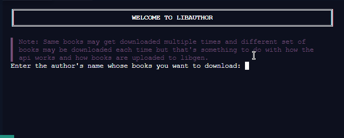

# Libauthor 📔️

Download books from an author in bulk.

## Getting Started 
Install the following packages- 
```
pip install libgen-api rich
```
or 
```
poetry install
```
Then-
```
cd libauthor
python main.py
```

## Usage 
Fairly basic just follow the prompts and press enter(⏎) when you want to use the default option.  
You have the option of changing the following search parameters :- 
* Language of the books
* Extension in which they are downloaded
* Whether you would like an exact match or be more flexible with your search

> NOTE: 
>* You gotta change all the parameters even when changing one the reason being I'm pretty lazy to implement too many option loops and that would make the program slower too.  
>* So its much better to just change the hardcoded function parameters.

## Screenshot


## License
Distributed under the MIT license. See LICENSE for details.
